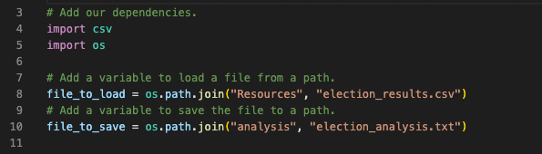

# Election Analysis Using Python & Visual Studio Code

The purpose of this project was to write an algorithm, or python script, that could tabulate the election results from three different counties in Colorado: Jefferson, Denver, and Arapahoe, and to determine the winning candidate of this election. By creating a script that could analyze thousands of rows of data, one could run this script and retrieve results in a matter of seconds. This script was also created in a manner that it could be used to analyze other county elections in different states. 

## Overview of Election Audit: 

A Colorado Board of Elections employee has given me the following tasks, listed numerically below, to complete the election audit of a recent local congressional election. I was given a csv(comma-separated value) file, which contained data that refereneced "Ballot Id", "County", and "Candidate" for each row. The purpose of the election audit was to determine who the candidates were that received votes from this dataset, the total number of votes received for each candidate, who the winner was based on the popular vote, the voter turnout from each county, and which county had the highest turnout. The dataset consisted of thousands of rows of data, which would normally take hours to separate and calculate all the aforementioned totals for the election audit. Thus, it was necessary to write a python script, or algorithm, to be able to run all of this information within seconds, as well as, providing a succinct output table expressing those results. I was also tasked with connecting my Github repository to my python script so that the script could be easily pushed to my repository without having to worry about copy and paste errors, indentation errors, and to be able to store copies of my script at different stages in the coding process. Being able to store my python script at different stages is important because if I edit my code and something breaks or results in an error, then I can retrieve a previous version that I know works without having to try to rewrite the entire code again to try and hope to fix the error. 

1. Calculate the total number of votes cast. 
2. Get a complete list of candidates who received votes. 
3. Calculate the total number of votes each candidate received. 
4. Calculate the percentage of votes each candidate won. 
5. Determine the winner of the election based on popular vote. 
6. Calculate the voter turnout for each county 
7. The percentage of votes from each county out of the total count 
8. The county with the highest turnout 

## Resources

- Data Source: election_results.csv
- Software: Python 3.10.5, Visual Studio Code 1.68.1

## The Data 

For this project, I was given a csv file containing a large amount of voter ballot data, with columns for "Ballot Id", "County", and "Candidate". The "County" column provided information for what county that voter ballot ID was from, and the "Candidate" column provided the name that the ballot Id was voting for. When writing this script in VS (Visual Studio) code, I had to create multiple variables that would be used in the subsequent for-loops, if-then conditional statements, and for my arithmetic calculations. In order to write my python script in VS code, I had to create a file path so that the csv file was able to be accessed, and I had to create a txt.file for the results to written to after I ran my script. There are two ways to create a file path, either by using a direct path or an indirect path to the file. Even though I knew the direct path to the election results csv file, I wanted to practice using an indirect path to the csv file. In some real-world settings, someone might want me to do an analysis on a file, where all I know is that it is in a specific folder, but I might not know where the file is on the computer, which makes it beneficial to know both methods. I have provided an example of how the indirect path method was used, (as shown below).

Using a with open statement, I am telling the computer to open the csv file and read the data inside the csv file. Then I had to create a couple for-loops, one to start counting the total votes for each candidate, and another to start counting the total votes for each county. To do this, I had to initialize a couple variables that were set equal to zero, and then add 1 each time it found a vote cast for one of the three candidates, and from what county that vote was cast from. By coding an if-then statement inside a for loop, each unique name was added to a designated list, one list that added the candidate names to, and another that added the county names to. These lists were created to start counting and adding the vote count for each list.  An example of how I used a with open statement, the use of for loops containing if-then statements, to append the three candidate and county names to the lists, "county_name = []" and "candidate_name = []", and how I was able to start tracking a count of the votes for the lists inside the dictionaries, "county_votes = {}" and "candidate_votes = {}" (as shown below).

Following the vote count, I had to create another with open statement to save the results to a text file that would print the election results. I created another for loop inside the with open statement, that would get the county from the previously created dictionary, and then calculate the total amount of votes, that were cast from each county, and using that total to provide a percentage of (votes counted) divided by the (total votes cast from all three counties) * 100 . Using an f-string, I was able to print a summary of the results for each county in the text file, which was written in a format that was easily readable. 

The same steps were used to print a summary of the total votes cast for each candidate. I used f-strings(or Formatted String Literals) to print my results for total candidate votes, total county votes, the percentages for the candidate and county breakdown, to display where the largest voter turnout was, and who the winning candidate was. The f-strings were placed in specific lines within the script, so that the analysis results were printed to the text file after each for loop was ran, and before the run of the next for loop. The nice thing about f-strings, is that it can be used in place of the print() function, which would require the use of concatenation because the analysis results contain variables that are of integer data types, and an extra step is needed to convert the integer data type to a string data type. An f-string can perform a calculation and will format the values of those calculations as a string, thus, that extra data type conversion is not necessary, and the code is more concise and easier to read. 

I have provided an example (shown below) of the utilization of f-strings within my python script, and illustrating the reasoning behind why the placement of an f-string matters.

## Election-Audit Results: 

After running my python script, the election-audit results, that were printed to my election_analysis.txt file, are shown below:  

    

The election-audit dataset contained 369,711 rows of data, in which each row was counted as one vote for one of the three candidates, from one of the three counties, based off of its ballot ID. Denver receieved the highest voter turnout, with 306,055 total votes, or 82.8% of all votes cast in this election. Jefferson received the second-most votes, with 38,855 total votes, or 10.5% of the total votes cast. Arapahoe had the lowest voter turnout, with only 24,801 total votes, or 6.7% of all the votes cast. 

As for the candidates, Diana DeGette was the candidate winner of the election, and she received 272,892 total votes, or 73.8% of the total votes cast overall. Charles Casper Stockham came in second place, and received 85,213 total votes, or 23.0% of the total votes cast. Raymon Anthony Doane came in last place, and only received 11,606 votes, or 3.1% of the total votes cast in this election. 

## Election-Audit Summary 

This script could be used for any election because the algorithm is set up in a way that one wouldn't need to make very many modifications to the overall script to run it using a different dataset. The variables to separate out the different candidate names and provide a list of each different candidate name, without listing duplicates of the same name, have already been coded. The calculations to count up how many total votes were cast for each candidate would remain the same on a different dataset. The only thing that would need to be changed would be the path that python would take to access a different csv file or dataset, as well as the txt_file name that this script would write the results to. Another thing that would need to be changed is if the header rows were set at a different index number in this other dataset, then those would need to be changed as well. Other than that, this script is actually pretty versatile in its ability to be used with other datasets that contain similar types of information. 

This script could be modified further if there were more characteristics or filters that provided other information, for example, age or party affiliations(i.e. Republican, Democrat, etc.), or even total amount of votes compared to total voter turnout in each county. By looking at age or party affiliations, one could use that information to decide which candidates might be more successful in receiving votes in a particular county; which could help political investors decide which candidates to they would want to invest their money into prior to an election. 

By looking at the total possible number of votes that could be cast vs. the total voter turnout in each county, it could help a candidate determine which counties might be better to market to or increase the amount of voter kiosk stations to provide voters with easier ways to access or get to these kiosks. Some counties might have areas that are largely spread out or have long roads that might deter some voters in even putting the effort into driving to these voter stations, which is why having more kiosk stations in more places could increase voter turnout. For example, Jefferson had a voter turnout of 85,213 votes received, but if there was 200,000 votes that could have been placed, then it would be important to know that because there might be a reason that over 100,000 votes were not made in that county. 

